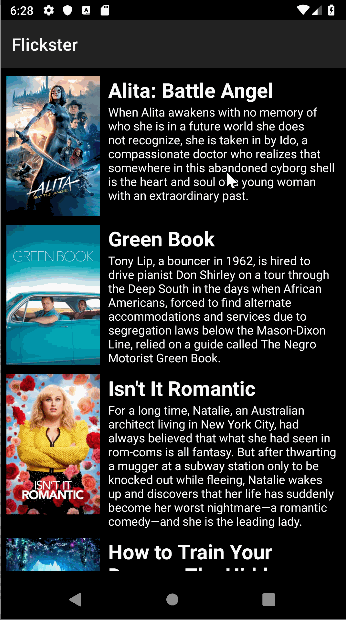

**Flicks**

* [x] User can view a list of movies (title, poster image, and overview) currently playing in theaters from the Movie Database API
* [x] Expose details of movie (ratings using RatingBar, popularity, and synopsis) in a separate activity
* [x] Allow video posts to be played in full-screen using the YouTubePlayerView
* [x] In landscape mode, the rotated alternate layout should use the backdrop image instead and show the title and movie overview to the right of it.
* [x] Improve the user interface through styling and coloring
* [x] Rounded corners for detail view
* [x] Detail view landscape-adaptive
* [x] Added ButterKnife dependency

## Video Walkthrough

Here's a walkthrough of implemented user stories:

Portrait Mode

Landscape Mode

                                
GIF created with [LiceCap](http://www.cockos.com/licecap/).

## Notes
It would improve to implement a pop-up screen to show further details about each movie

